# 👻 GhostLink: The Invisible Tunnel


> **Bypass restrictions, browse securely, and vanish.**
> GhostLink tunnels your HTTP/HTTPS traffic exclusively over a single persistent WebSocket connection, allowing you to access the web through a remote perspective with ease.

---

## 🌟 Why GhostLink?

*   **🛡️ Firewalls? What Firewalls?**: Since the connection is initiated *outbound* via standard HTTP/HTTPS ports to your server, it punches through most ingress firewalls and NATs effortlessly.
*   **⚡ Blazing Fast Multiplexing**: No more handshake overhead for every request. We multiplex all your browser streams over one single, long-lived WebSocket tunnel.
*   **🔒 Secure & Invisible**: Traffic is encapsulated. To the outside observer, it's just a single WebSocket connection.
*   **🔌 Plug & Play**: Pure Node.js. No complex VPN setup. Just run the client and server, and you're good to go.

---

## 🏗️ Architecture

```mermaid
graph LR
    Browser[💻 Browser] -- HTTP/HTTPS --> Client[👻 GhostLink Relay]
    Client <== WebSocket Tunnel ==> Server[☁️ GhostLink Server]
    Server -- Requests --> Internet[🌍 Internet]
```



1.  **GhostLink Relay (Client)**: Acts as your local SOCKS/HTTP proxy.
2.  **The Tunnel**: A robust, persistent WebSocket connection carrying all your data.
3.  **GhostLink Server**: The exit node that fetches the internet for you.

---

## 🛠️ Installation

```bash
git clone https://github.com/yourusername/ghostlink.git
cd ghostlink
npm install
```

---

## 🚀 Quick Start

### 1. Fire up the GhostLink Server (Remote Exit Node)
On your VPS/Remote Server:
```bash
# Listen on 0.0.0.0:8081 (default)
node server.js

# Custom port and bind address
node server.js -p 9000 -h 127.0.0.1
```

### 2. Connect the Relay (Local Machine)
On your laptop:
```bash
# Connect to default (ws://localhost:8081) and listen on 8080
node client.js

# Connect to remote server, binding local proxy to 127.0.0.1:3000
node client.js --tunnel ws://my-vps.com:8081 -p 3000 -h 127.0.0.1
```

### 3. Surf!
Configure your browser proxy settings based on the local port you chose.

---

## ⚙️ Configuration

GhostLink uses command-line arguments:

### Server (`server.js`)
*   `-p, --port` : Port to listen on (Default: `8081`)
*   `-h, --host` : Host/IP to bind to (Default: `0.0.0.0`)

### Client (`client.js`)
*   `-p, --port`   : Local proxy port (Default: `8080`)
*   `-h, --host`   : Local bind address (Default: `127.0.0.1`)
*   `-t, --tunnel` : WebSocket URL of the remote server (Default: `ws://localhost:8081`)

---

## 📜 License

This project is licensed under the **GNU General Public License v3.0**.  
See the [LICENSE](./LICENSE) file for details.

---

<p align="center">
  Made with ❤️ by Ztan.
</p>
